# Architecture

This document describes the internal architecture of each Chainlink Framework module and how they interact.

## System Overview

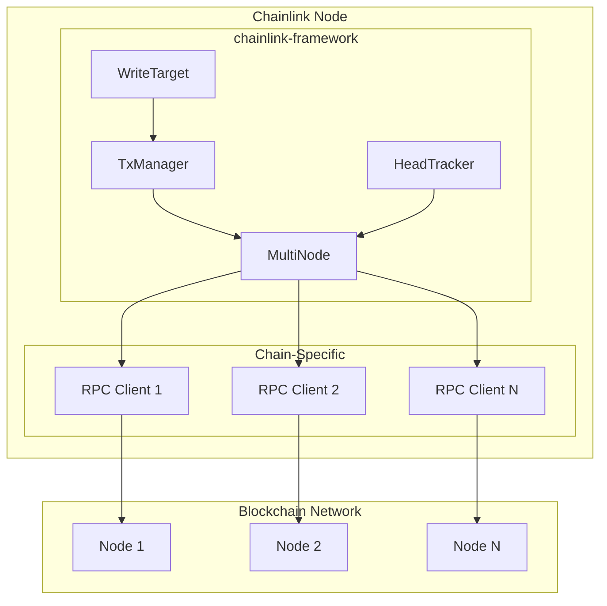

## MultiNode Architecture

MultiNode is the core component that manages connections to multiple RPC endpoints, providing health monitoring, load balancing, and automatic failover.

### Component Diagram

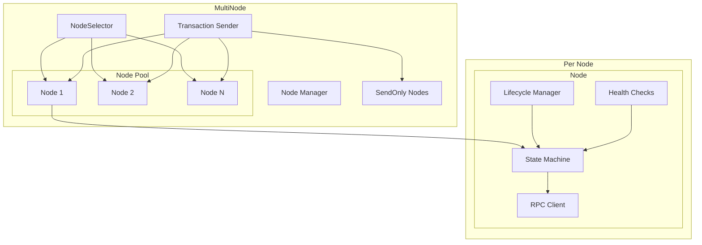

### Node State Machine

Each node maintains a finite state machine tracking its health status:

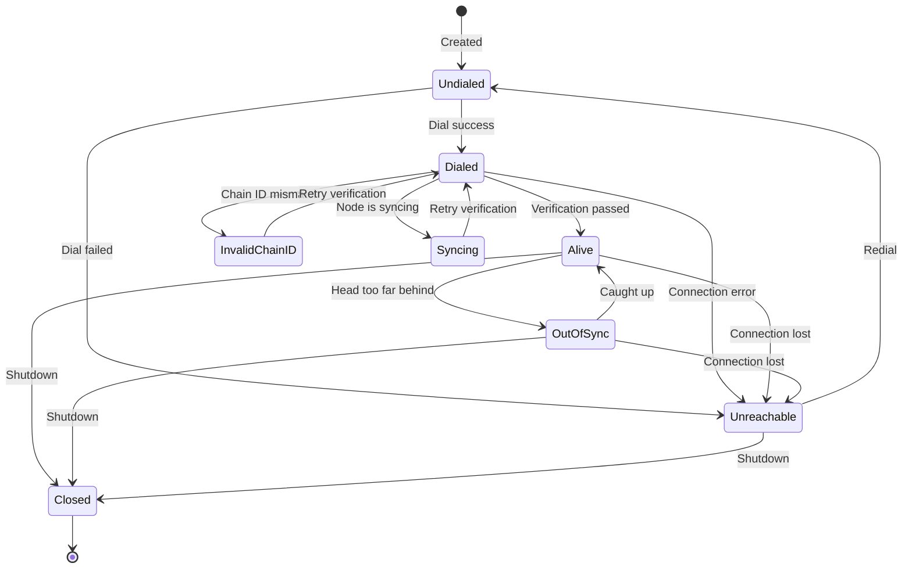

### Node Selection Flow

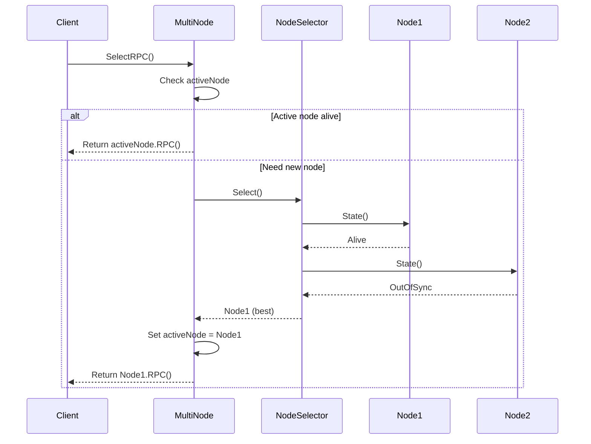

## Transaction Manager (TxManager)

The TxManager handles transaction lifecycle from creation through finalization.

### Component Structure

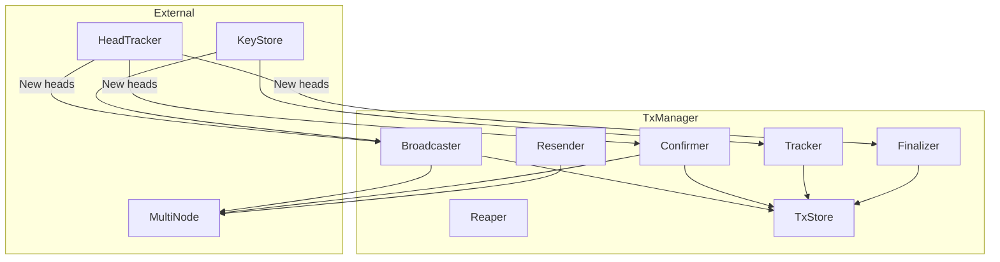

### Transaction Lifecycle

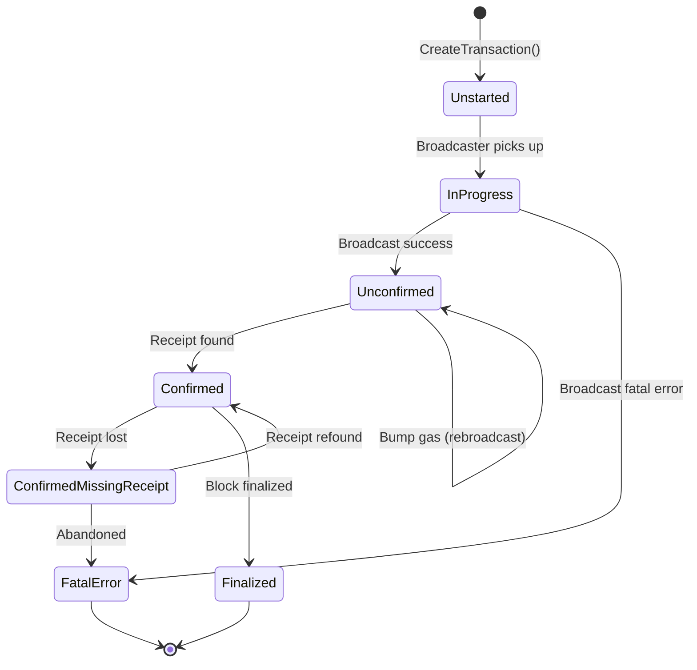

### Transaction Flow

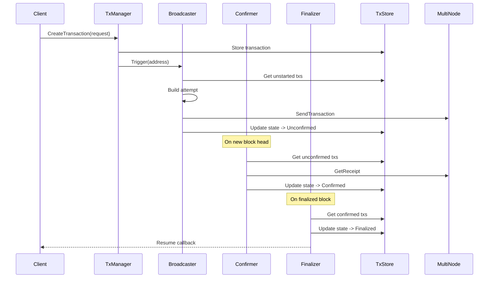

## Head Tracker

The HeadTracker monitors blockchain heads and maintains a local chain cache.

### Component Structure

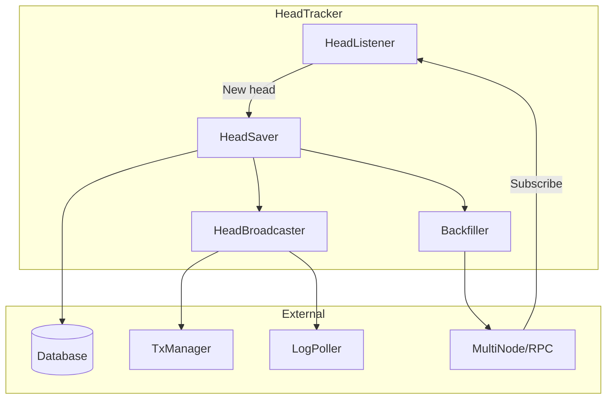

### Head Processing Flow

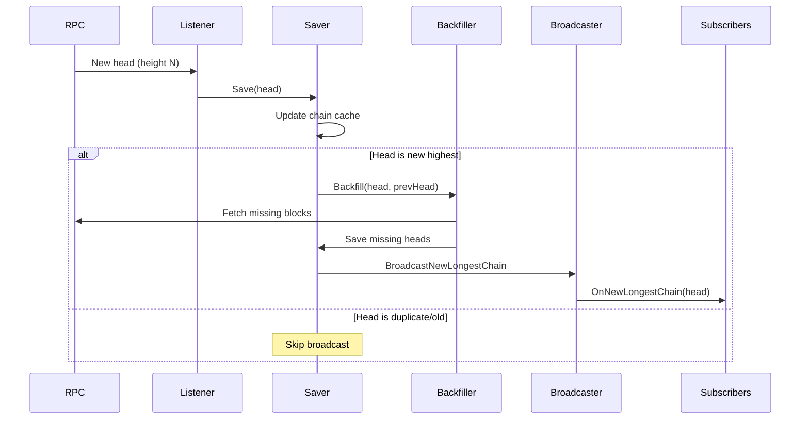

## Write Target (Capabilities)

The WriteTarget capability enables chain-agnostic transaction submission for Chainlink workflows.

### Component Structure

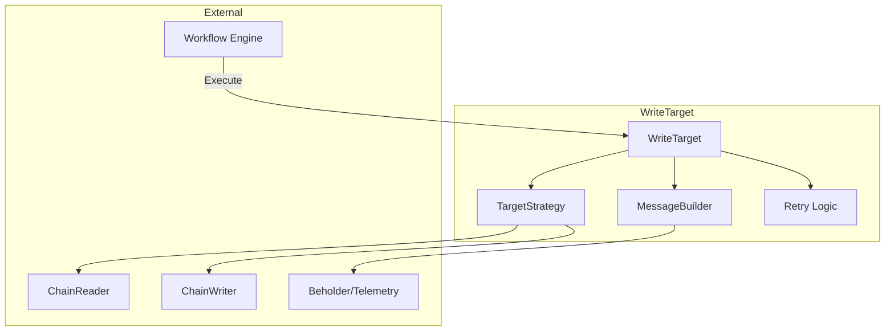

### Write Execution Flow

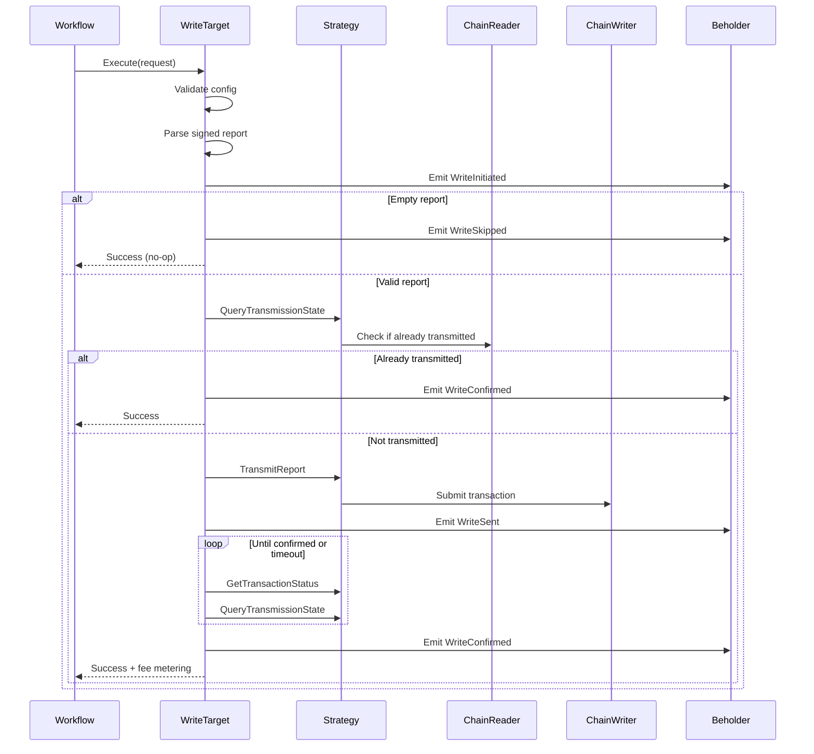

## Data Flow Summary

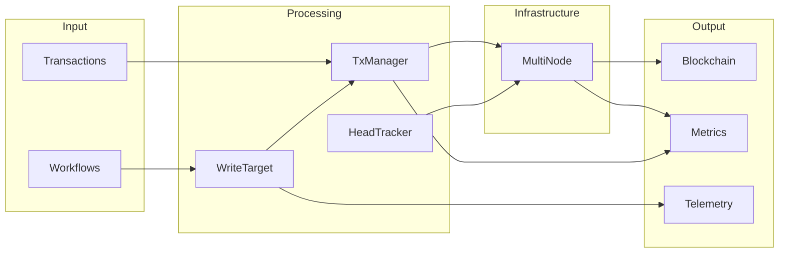

## Key Design Principles

1. **Generic Types**: All components use Go generics to remain chain-agnostic
2. **Interface-Based**: Chain-specific behavior is injected via interfaces
3. **Service Pattern**: Components implement `services.Service` for lifecycle management
4. **Observability**: Built-in metrics and structured logging throughout
5. **Resilience**: Automatic retries, reconnection, and graceful degradation
