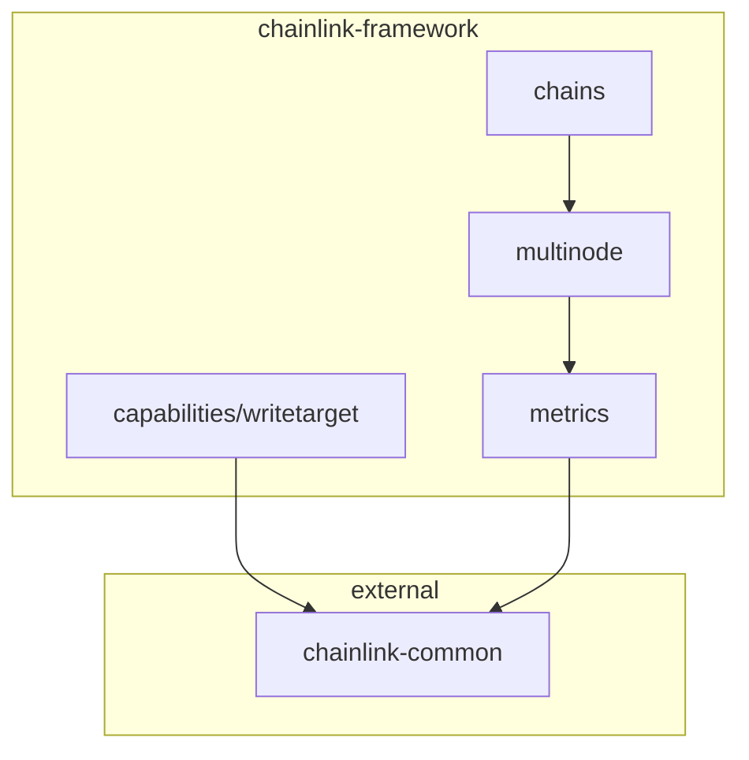

# Chainlink Framework

> Common components for Chainlink blockchain integrations across EVM and non-EVM chains.

## Purpose

Chainlink Framework provides the foundational building blocks used by Chainlink's Blockchain Integrations team to support multi-chain operations. These components abstract away chain-specific complexities, enabling consistent behavior across diverse blockchain ecosystems.

## Value Proposition

- **Multi-RPC Resilience**: Connect to multiple RPC endpoints simultaneously with automatic failover and health checks
- **Chain-Agnostic Design**: Generic interfaces that work with any blockchain via type parameters
- **Production-Ready**: Battle-tested components used across Chainlink's chain integrations
- **Observable**: Built-in metrics, tracing, and monitoring via Prometheus and OpenTelemetry

## Target Audience

- **Chain Integration Developers**: Teams integrating new blockchains with Chainlink
- **Node Operators**: Operators running Chainlink infrastructure
- **Contributors**: Developers extending Chainlink's multi-chain capabilities

## Prerequisites

- **Go 1.21+**
- Familiarity with Go generics
- Understanding of blockchain concepts (RPC, transactions, finality)

## Modules

The framework is organized as a Go workspace with four main modules:

| Module           | Path            | Description                                                             |
| ---------------- | --------------- | ----------------------------------------------------------------------- |
| **MultiNode**    | `multinode/`    | Multi-RPC client with health checks, load balancing, and node selection |
| **Chains**       | `chains/`       | Core chain abstractions including TxManager and HeadTracker             |
| **Capabilities** | `capabilities/` | Chainlink capability implementations (WriteTarget)                      |
| **Metrics**      | `metrics/`      | Prometheus metrics for chain observability                              |

## Module Dependencies

## Quick Links

- [Getting Started](getting-started.md) — Installation and first steps
- [Architecture](architecture.md) — Deep dive into component design
- [Usage Guide](usage-guide.md) — Integration patterns and examples
- [Contributing](contributing.md) — Development setup and workflow
