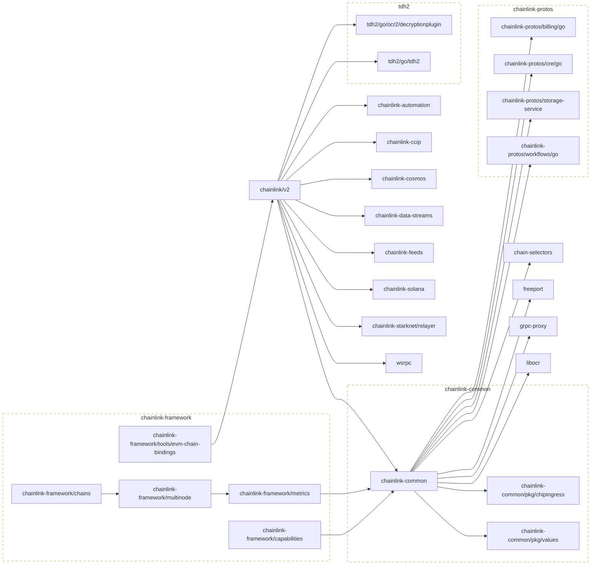

# smartcontractkit Go modules
## All modules

```mermaid
flowchart LR

	chain-selectors
	click chain-selectors href "https://github.com/smartcontractkit/chain-selectors"
	chainlink-automation
	click chainlink-automation href "https://github.com/smartcontractkit/chainlink-automation"
	chainlink-ccip
	click chainlink-ccip href "https://github.com/smartcontractkit/chainlink-ccip"
	chainlink-common --> chain-selectors
	chainlink-common --> chainlink-common/pkg/chipingress
	chainlink-common --> chainlink-common/pkg/values
	chainlink-common --> chainlink-protos/billing/go
	chainlink-common --> chainlink-protos/cre/go
	chainlink-common --> chainlink-protos/storage-service
	chainlink-common --> chainlink-protos/workflows/go
	chainlink-common --> freeport
	chainlink-common --> grpc-proxy
	chainlink-common --> libocr
	click chainlink-common href "https://github.com/smartcontractkit/chainlink-common"
	chainlink-common/pkg/chipingress
	click chainlink-common/pkg/chipingress href "https://github.com/smartcontractkit/chainlink-common"
	chainlink-common/pkg/values
	click chainlink-common/pkg/values href "https://github.com/smartcontractkit/chainlink-common"
	chainlink-cosmos
	click chainlink-cosmos href "https://github.com/smartcontractkit/chainlink-cosmos"
	chainlink-data-streams
	click chainlink-data-streams href "https://github.com/smartcontractkit/chainlink-data-streams"
	chainlink-feeds
	click chainlink-feeds href "https://github.com/smartcontractkit/chainlink-feeds"
	chainlink-framework/capabilities --> chainlink-common
	click chainlink-framework/capabilities href "https://github.com/smartcontractkit/chainlink-framework"
	chainlink-framework/chains --> chainlink-framework/multinode
	click chainlink-framework/chains href "https://github.com/smartcontractkit/chainlink-framework"
	chainlink-framework/metrics --> chainlink-common
	click chainlink-framework/metrics href "https://github.com/smartcontractkit/chainlink-framework"
	chainlink-framework/multinode --> chainlink-framework/metrics
	click chainlink-framework/multinode href "https://github.com/smartcontractkit/chainlink-framework"
	chainlink-framework/tools/evm-chain-bindings --> chainlink/v2
	click chainlink-framework/tools/evm-chain-bindings href "https://github.com/smartcontractkit/chainlink-framework"
	chainlink-protos/billing/go
	click chainlink-protos/billing/go href "https://github.com/smartcontractkit/chainlink-protos"
	chainlink-protos/cre/go
	click chainlink-protos/cre/go href "https://github.com/smartcontractkit/chainlink-protos"
	chainlink-protos/storage-service
	click chainlink-protos/storage-service href "https://github.com/smartcontractkit/chainlink-protos"
	chainlink-protos/workflows/go
	click chainlink-protos/workflows/go href "https://github.com/smartcontractkit/chainlink-protos"
	chainlink-solana
	click chainlink-solana href "https://github.com/smartcontractkit/chainlink-solana"
	chainlink-starknet/relayer
	click chainlink-starknet/relayer href "https://github.com/smartcontractkit/chainlink-starknet"
	chainlink/v2 --> chainlink-automation
	chainlink/v2 --> chainlink-ccip
	chainlink/v2 --> chainlink-common
	chainlink/v2 --> chainlink-cosmos
	chainlink/v2 --> chainlink-data-streams
	chainlink/v2 --> chainlink-feeds
	chainlink/v2 --> chainlink-solana
	chainlink/v2 --> chainlink-starknet/relayer
	chainlink/v2 --> tdh2/go/ocr2/decryptionplugin
	chainlink/v2 --> tdh2/go/tdh2
	chainlink/v2 --> wsrpc
	click chainlink/v2 href "https://github.com/smartcontractkit/chainlink"
	freeport
	click freeport href "https://github.com/smartcontractkit/freeport"
	grpc-proxy
	click grpc-proxy href "https://github.com/smartcontractkit/grpc-proxy"
	libocr
	click libocr href "https://github.com/smartcontractkit/libocr"
	tdh2/go/ocr2/decryptionplugin
	click tdh2/go/ocr2/decryptionplugin href "https://github.com/smartcontractkit/tdh2"
	tdh2/go/tdh2
	click tdh2/go/tdh2 href "https://github.com/smartcontractkit/tdh2"
	wsrpc
	click wsrpc href "https://github.com/smartcontractkit/wsrpc"

	subgraph chainlink-common-repo[chainlink-common]
		 chainlink-common
		 chainlink-common/pkg/chipingress
		 chainlink-common/pkg/values
	end
	click chainlink-common-repo href "https://github.com/smartcontractkit/chainlink-common"

	subgraph chainlink-framework-repo[chainlink-framework]
		 chainlink-framework/capabilities
		 chainlink-framework/chains
		 chainlink-framework/metrics
		 chainlink-framework/multinode
		 chainlink-framework/tools/evm-chain-bindings
	end
	click chainlink-framework-repo href "https://github.com/smartcontractkit/chainlink-framework"

	subgraph chainlink-protos-repo[chainlink-protos]
		 chainlink-protos/billing/go
		 chainlink-protos/cre/go
		 chainlink-protos/storage-service
		 chainlink-protos/workflows/go
	end
	click chainlink-protos-repo href "https://github.com/smartcontractkit/chainlink-protos"

	subgraph tdh2-repo[tdh2]
		 tdh2/go/ocr2/decryptionplugin
		 tdh2/go/tdh2
	end
	click tdh2-repo href "https://github.com/smartcontractkit/tdh2"

	classDef outline stroke-dasharray:6,fill:none;
	class chainlink-common-repo,chainlink-framework-repo,chainlink-protos-repo,tdh2-repo outline
```
